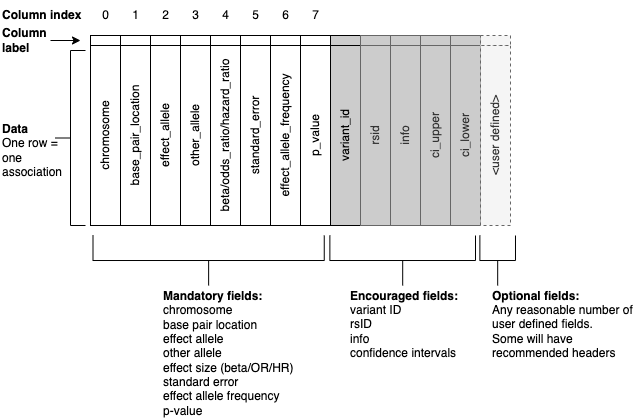

# Introduction

Summary statistics are defined as the aggregate p-values and association data for every variant analysed in a genome-wide association study (GWAS). The depth of information contained in the summary statistics represents huge potential to extend the power of GWAS and improve disease understanding. In recent years a number of methods have been developed to enable the use of GWAS summary statistics to gain insights into the mechanisms of complex disease, identify new drug targets and evaluate disease risk. Example methods include large meta-analyses [@28898252:PMID], trait pleiotropy [@28746715:PMID], prediction using polygenic scores (PGS) [@31363735:PMID] and Mendelian randomisation (MR) [@28981501:PMID]. However, still a considerable number of summary statistics are not fully and openly shared with the community, either being made available under controlled access, upon agreement to restrictive terms, with incomplete data, or not shared at all.  One of the main challenges associated with sharing full GWAS results is the lack of standards for data content and format, meaning that researchers do not have clear guidelines for appropriate file generation for sharing, and the re-usability of the resulting files can be poor. Typically, each GWAS will produce a single file with a table of summary statistics containing a list of variants with p-values, other statistics and relevant annotations or metadata. Generated by different software packages and made available via different resources, summary statistics can vary in a myriad of ways from one study to the next. A recent analysis of 327 summary statistics files found over 100 unique formats [@34601555:PMID]. Differences in file formats, header definitions, data types, genetic variant or association data reporting and missing data create challenges for users by reducing data interoperability.

The GWAS Catalog began hosting summary statistics in 2018, and rapidly developed a first minimal data format based on the most commonly included fields in publicly available files [@2019wv:Buniello], but without community input. In parallel, other summary statistics formats have been defined for specific purposes, e.g. dbGap’s Minimum Information Required for Association Data guidelines, designed to fulfil data sharing requirements in dbGaP (https://www.ncbi.nlm.nih.gov/gap/docs/submissionguide/#apha); GWAS-VCF [@33441155:PMID] developed for robustness and performance and to underpin the OpenGWAS platform [@PPR199104:PPR] and associated tools. Limitations to more widespread adoption of the GWAS-VCF are that it requires knowledge of bioinformatics and relevant tools to parse and prepare, which present a barrier to data sharing for some users.

The field is advancing rapidly and summary statistics data sharing is quickly becoming more common. More than 70% of GWAS Catalog studies are now linked to freely accessible summary statistics (27,500 studies from 550 publications) with the highest yearly increment observed in 2020-2021, and 77% of summary statistics submissions to the GWAS Catalog in 2021 were made before publication, upon a journal's mandate. These metrics show that GWAS summary statistics have now reached a critical mass, and to maximise the utility of this body of data there is a need for the community to adopt a standard to which users can expect all studies to adhere [@MACARTHUR2021100004].  A single standard with stricter definitions on the data included will increase the utility of GWAS summary statistics, reduce the risk of misinterpretation of data and enable users to easily analyse and integrate data from different GWAS. A range of mandatory data fields are required to support the major use cases for downstream analysis, such as PGS development, MR, meta-analysis and functional annotation of variants, at scale.

Following initial discussions with the GWAS community at the 2020 workshop, which provided a defined set of recommendations as an outcome [@MACARTHUR2021100004], the GWAS Catalog hosted a series of meetings between June 2021 and September 2021 with summary statistics stakeholders including data generators, data users, data managers and bioinformaticians, representing diverse user groups. These meetings gathered requirements and identified challenges. The aim of this process was to set minimum information elements for data sharing to maximise downstream utility. During these meetings a phase of iteration on the proposed standard was completed and the final outcome is detailed here.

# Requirements

The key requirements obtained from the stakeholders’ use cases were as follows:

* Consistent representation of data to enable interoperability
* Easily accessible metadata for summary statistics to facilitate data interpretation and re-usability
* Unambiguously reported genetic variants for standard annotation
* A set of mandatory (i.e. must be present and filled with non-null values) fields, providing the information necessary to enable a wide range of data analyses including MR and PGS development
* A set of encouraged fields with standard headers, which are strongly recommended but not mandatory 
* A balance between these mandatory and encouraged fields that includes essential data but does not set the bar impossibly high for the community using and implementing the standard
* A low bioinformatics requirement for data consumers and data producers, reflecting the composition of the user community, to maximise stakeholder uptake 

These requirements were used to define the backbone of a format - the GWAS-SSF - which will be implemented within the GWAS Catalog and promoted more widely in the community. The format has been designed to be interoperable with other major formats and resources. We continue to take public feedback on the proposed format via our github repository https://github.com/EBISPOT/gwas-summary-statistics-standard or via email to gwas-info@ebi.ac.uk.

# GWAS-SSF, a new GWAS summary statistics format
The GWAS summary statistics format (GWAS-SSF) is composed of two files, the summary statistics data file and accompanying metadata file.

## Summary statistics data formt
The GWAS-SSF data file is a TSV flat file of tab-delimited values that can be compressed (see Figure \ref{schematic}) for a schematic representation, https://github.com/EBISPOT/gwas-summary-statistics-standard/examples/0000123.tsv for example file), reporting data from a single genome-wide analysis. The first line of the file contains the headers to the table. The rows after the header store the variant association data. Where permitted, values can be omitted by the presence of “NA”. There are no limits to the number of rows or columns that the table can have, however, a set of mandatory fields (defined in Table 1) must be present in a defined order. A file may contain additional columns beyond the set of mandatory fields. Table 1 shows some non-mandatory (encouraged) fields that may be present.

## Summary statistics table contents
Four fields in the summary statistics table, combined with the reference genome assembly provided in a metadata file (see below), unambiguously define the genetic variants (all field definitions can be found in Table 1). These fields are the chromosome (_chromosome_), the genomic location position on the chromosome (_base_pair_location_), the effect allele (_effect_allele_), and the non-effect allele (_other_allele_). Chromosome values are integers from 1 to 25, with chromosome X mapping to 23, chromosome Y to 24, and mitochondrial to 25. Genomic location is an integer value representing the first position of the variant in the reference genome, using 1-based indexing (see Figure \ref{var_rep}) to maximise interoperability with variant call format (VCF) [@2011ut:Danecek]. The _effect_allele_ field captures the allele for which the effect is associated, while the _other_allele_ field reports the non-effect allele. Both of the allele fields will contain allele strings, including cases where variants are insertions and deletions (see Figure \ref{var_rep}). These four fields (_chromosome_, _base_pair_location_, _effect_allele_, _other_allele_) are concatenated to populate the _variant_id_ field and rsID can be stored in the _rsid_ field, but both fields are optional. 

Table 1. Summary statistics field definitions

| Field name     | Description                | Accepted values      | Field type   |
|----------------|----------------------------|----------------------|--------------|
| chromosome     | Column 0: Chromosome where | [1-25]               | Mandatory    |
|                | the variant is located     |                      |              |
|                | (X=23, Y=24, MT=25)        |                      |              |
| base_pair_loc- | Column 1: The first posit- | x > 0                | Mandatory    |
| ation          | ion of the variant in the  |                      |              |
|                | reference, counting on the |                      |              |
|                | bases, from 1 (1-based)    |                      |              |
| effect_allele  | Column 2: Allele associat- | `[ACGT]+`            | Mandatory    |
|                | ed with the effect         |                      |              |
| other_allele   | Column 3: The non-effect   | `[ACGT]+`            | Mandatory    |
|                | allele                     |                      |              |
| beta           | Column 4: Effect beta      | Numeric              | Mandatory*   |
| odds_ratio     | Column 4: odds ratio       | x >= 0               | Mandatory*   |
| hazard _ratio  | Column 4: hazard ratio     | x >= 0               | Mandatory*   |
| standard_error | Column 5: Standard error   | Numeric              | Mandatory    |
| effect_all-    | Column 6: Frequency of the | 0=<x<=1              | Mandatory    |   
| ele_frequency  | effect allele              |                      |              |
| p_value        | Column 7: P-value of the   | 0=<x<=1 or x >= 0 if | Mandatory    |
|                | association statistic      | p_value is -log10    |              |
| ci_upper       | Upper confidence interval  | Numeric              | Encouraged   |
| ci_lower       | Lower confidence interval  | Numeric              | Encouraged   |
| rsid           | rsID                       | ^rs[0-9]+$           | Encouraged   |
| variant_id     | Internal variant identif-  | [1-25]\_[0-9]+\_([AC | Encouraged   |
|                | ier by concatenating chr-  | GT]+\_[ACGT]+\|LONG- |              |
|                | osome, base_pair_locaion   | _STRING)**           |              |
|                | n, other_allele and effec- |                      |              |
|                | t_allele with underscores  |                      |              |
| info           | Imputation information     | 0=<x<=1              | Encouraged   |
|                | metric                     |                      |              | 
| n              | Sample size                | integer              | Encouraged   |
| hm_code        | Harmonisation code, which  | integer              | Harmonised   |
|                | can be looked up in the    |                      | datasets     |
|                | metadata to determine the  |                      | only         |
|                | transformation             |                      |              |

\* Mandatory that either beta, odds_ratio or hazard_ratio is given  
\*\* 'LONG\_STRING' can be used where allele string is too long to be represented.  

All rows contain the following association statistics: p-value (_p_value_), the effect size (either _beta_, _odds_ratio_ or _hazard_ratio_), and the standard error (_standard_error_). Depending on the precision of software that performed the calculation of association, p-values in GWAS analyses may appear rounded to zero or one. This is particularly problematic where highly significant associations (e.g. p<10E-300) are rounded to zero, preventing associations being ranked in order of significance. Calculation of accurate p-values is recommended where possible. Where this is not possible due to limitations of the software used, the GWAS-SSF requires the analysis and genotype imputation software and version to be present in the metadata, to help users of the summary statistics interpret these values. Alternatively, p-values can be expressed as negative log values, in which case the metadata field _pvalueIsNegLog10_ should be set to true.  
Effect allele frequency (_effect_allele_frequency_) is a mandatory field. However, where privacy concerns might otherwise be a barrier to sharing the data, a cutoff may be specified in the metadata (_effectAlleleFreqLowerLimit_ field, see Table 2) so that frequencies below that cutoff are rounded-up to mask their true values. For example, `effectAlleleFreqLowerLimit = 0.01` in the metadata file would communicate that the lowest possible value for the effect allele frequency in this file is 0.01, and anything below this threshold has been rounded up to 0.01.

## Summary statistics metadata
An additional file accompanies the summary statistics data file containing metadata describing the summary statistics such as the name and md5sum of the summary statistics data file (see https://github.com/EBISPOT/gwas-summary-statistics-standard/examples/0000123.yaml for example) and the GWAS metadata itself, including sample and experimental metadata (Table 2), thereby ensuring the reusability of the data. The metadata file fields can be expanded as needed in the future, and as with the summary statistics file, additional columns can be included as required. Sample metadata fields include descriptions of the trait under investigation and the sample size and ancestry. An additional field ancestryMethod can be used to indicate whether the ancestry descriptor is self-reported or genetically defined (encouraged). We recommend that ancestry is reported according to the standardised framework guidelines described in @29448949:PMID. Every effort should be made to explicitly note whether the sample is admixed and the ancestral backgrounds that contribute to admixture. The trait description is free text and should include a clear description of the trait under study, including any relevant background characteristics of the study population, e.g. “lung cancer in asthma patients”. Trait ontology terms can be stored in the metadata ontologyMapping field. The metadata file is in YAML format, which is “a human-friendly data serialisation language for all programming languages“ (https://yaml.org/). There are both mandatory and encouraged metadata fields, which are detailed in Table 2. 

Table 2. Metadata field definitions

| Field              | Description            | Accepted value       | Mandatory    |
|--------------------|------------------------|----------------------|--------------|
| genomeAssembly     | Genome assembly        | GRCh/NCBI/UCSC value | Yes          |
| traitDescription   | Author reported trait  | Text string          | Yes          |
|                    | description            | (multiple possible)  |              |
| sampleSize         | Sample size            | Integer              | Yes          |
| caseCount          | Number of cases for    | Integer              | Yes if case- |
|                    | case/control study     |                      | ControlStudy |
| controlCount       | Number of controls for | Integer              | Yes if case- |
|                    | case/control study     |                      | ControlStudy |
| caseControlStudy   | Flag whether the study | Boolean              | No (default  |
|                    | is case-control study  |                      | is false)    |
| sampleAncestry     | Sample ancestry        | Text string          | Yes          |
|                    |                        | (multiple possible)  |              |
| genotypingTechnol- | Genotyping technology  | Text string          | Yes          |
| ogy                |                        | (multiple possible)  |              |
| analysisSoftware   | Association analysis   | Text string          | Yes if       |
|                    | software and version   |                      | p-value of 0 |
| imputationPanel    | Imputation panel       | Text string          | No           |
| imputationSoftware | Imputation software    | Text string          | No           |
| effectAlleleFreqL- | Lowest possible effect | Numeric              | No           |
| owerLimit          | allele frequency       |                      |              |
| ancestryMethod     | Method to determine    | Text string          | No           |
|                    | sample ancestry e.g.   | (multiple possible)  |              |
|                    | self-reported or       |                      |              |
|                    | genetically determined |                      |              |
| sortedByGenomicLo- | Flag whether the file  | Boolean              | Yes          |
| cation             | is sorted by genomic   |                      |              |
|                    | location               |                      |              |
| effectStatistic    | Indicate whether beta  | beta, odds ratio or  | yes          |
|                    | or odds ratio is used  | hazard ratio         |              |
| hmodeDefinition    | Description of         | Text string          | Harmonised   |
|                    | harmonisation codes    |                      | datasets     |
|                    |                        |                      | only         |
| pvalueIsNegLog10   | Flag whethe  p value   | Boolean              | No (default  |
|                    | is negative log10      |                      | is false)    |
| adjustedCovariates | Any covariates the     | Text string          | No           |
|                    | GWAS is adjusted for   | (multiple possible)  |              |
| ontologyMapping    | Short form ontology    | Text string          | No           |
|                    | terms describing the   | (multiple possible)  |              |
|                    | trait                  |                      |              |

# Remaining steps to first implementation of GWAS-SSF
A number of steps are required to fully implement the new standard, and these are under active development, with an estimated release date in late 2022. 

1. Updated validator for submitted summary statistics  
The validator runs upon submission of summary statistics to the GWAS Catalog, and must pass in order for data to be successfully submitted. An offline version is provided for users to check the validity of their files prior to upload with detailed feedback provided on failures. The validator will be updated to ensure files adhere to the new format. 
2. Generation of a metadata file  
In the GWAS Catalog submission tool, metadata can be entered via a simple Excel-based form. The submissions processing pipeline will be modified to generate a metadata YAML file upon release of summary statistics. The scripts used to do this will be made publicly available under the Apache version 2.0 open source license (https://www.apache.org/licenses/LICENSE-2.0). Metadata files will be generated retrospectively for all pre-existing summary statistics in the Catalog. 
3. Updated harmonisation of summary statistics  
Formatted files are processed internally to produce the harmonised version, requiring no further input by the submitter. The harmonisation pipeline (https://github.com/EBISPOT/gwas-sumstats-harmoniser) is publicly available to enable data generators to produce their own harmonised versions. This pipeline will be changed to accommodate field changes, and harmonised files will be sorted and indexed by genomic location optimised for fast retrieval of variants. The technology that will be used to do this is currently under investigation. 
4. Provision of tools for the generation of GWAS-SSF  
PLINK [@17701901:PMID], one of the most popular GWAS data analysis tools, has committed to creating an option to generate results files in the standard format, thus removing the need for data generators to further manipulate  files after analysis prior to submission to the GWAS Catalog. We also plan to make available a formatting tool to easily convert from the outputs of other analysis softwares such as METAL. 
5. Ensuring interoperability with other resources  
As outlined above, we have designed GWAS-SSF to be compatible with GWAS-VCF. dbGaP will accept submissions of GWAS summary statistics in the standard format to ensure flow of data between these two important public resources. We hope that other resources will follow suit to enhance interoperability and maximise the number of datasets that can be available in a central resource.
 
# Discussion
Community activities have been effective in the development of agreed standards and sharing principles for scientific data e.g. @2001ui:Brazma. The GWAS summary statistics format (GWAS-SSF) presented here is the result of meetings with the community to make a simple, easy to access standard which promotes cross-dataset consistency and is useful for varied use cases. The mandatory content of the table meets the requirement set by the stakeholders of the working group to perform most analyses e.g. beta and standard error to support MR analyses, effect and non-effect allele to support meta-analysis and generation of polygenic scores. Another requirement from the working groups is a consistent approach to variant reporting and representation which is important for users of the data to be able to easily merge or compare datasets. By adopting the variant reporting standard embodied in VCF [@2011ut:Danecek] to define single nucleotide polymorphisms and short indels, consistency and interoperability will be achieved. More complicated variants (e.g. structural variants) and their shorthand notations fall outside the primary scope of GWAS summary statistics. Regarding file type, large numbers of GWAS summary statistics have been stored in the GWAS-VCF format (@33441155:PMID; @PPR199104:PPR), but less-technical stakeholders preferred a TSV file and we have (in collaboration with representatives from the MRC IEU) codesigned a generic TSV/YAML format and maintained interoperability with VCF. 

Metadata for the summary statistics files and study design are available in a separate file. There are advantages to storing metadata within data files, primarily that the metadata and summary statistics cannot become inadvertently decoupled, but this complicates file parsing whereas a generic tabular file format is universally accessible. The metadata is therefore an optional source that can help reduce ambiguity and provide useful information about the datasets.

The GWAS-SSF is designed to represent each GWAS analysis in a separate file, and in this respect differs from the GWAS-VCF which can represent multiple phenotypes in the same file. Although there are some advantages in sharing data between individual users in this way, the number of GWAS per unit is rapidly growing, for example >18K phenotypes in @34375979:PMID, and this may cause usability issues to the average user where large volumes of data are stored in a single file. Data stored in the GWAS-SSF with the required data elements can be easily converted to GWAS-VCF if required using publicly available tools [@33441155:PMID].

GWAS-SSF includes a number of mandatory fields, and we heard from our working group that many more fields may be important in certain contexts, e.g. imputation info for filtering variants to identify those of high enough quality for downstream analyses, such as fine-mapping, enrichment analyses, MR, or genetic correlation estimation.  However, there was an acceptance that these may not be readily available or necessary for all users and their absence should not preclude data sharing and reuse. The standard should promote open data sharing as widely as possible, while providing the essential information for most major downstream uses. We have therefore included additional encouraged fields with standard headers to promote interoperability, and data generators are strongly encouraged to share these data unless they are genuinely unavailable (for example, in the case of historical/legacy data) or there is a scientific or ethical reason not to (e.g. privacy concerns).  Furthermore, the list of standard fields is not intended to be exhaustive and data generators are encouraged to share as much additional data as possible. 

FAIRification of GWAS results is currently a significant challenge for the genetics community, as thoroughly discussed in our working group meetings and reported in this work. The new community driven GWAS summary statistics format we propose conforms to the FAIR principles [@26978244:PMID] and we believe that its widespread adoption will facilitate sharing and usability of summary statistics in the public domain. 

# Acknowledgements
We thank working group participants and the wider community for their engagement and contributions. Research reported in this publication was supported by the National Human Genome Research Institute of the National Institutes of Health under award no. U41HG007823 and EMBL-EBI Core Funds. In addition, we acknowledge funding from: the European Molecular Biology Laboratory; I.B., “Expanding excellence in England” award from Research England; ML, the MRC Integrative Epidemiology Unit (MC_UU_00011/4), supported by the NIHR Biomedical Research Centre at University Hospitals Bristol and Weston NHS Foundation Trust and the University of Bristol. The content is solely the responsibility of the authors and does not necessarily represent the official views of the National Institutes of Health, the NHS, the National Institute for Health and Care Research or the Department of Health. 

For citations of references, we prefer the use of parenthesis, last name and year. If you use a citation manager, Elsevier – Harvard or American Psychological Association (APA) will work. If you are referencing web pages, software or so, please do so in the same way. Whenever possible, add authors and year. We have included a couple of citations along this document for you to get the idea. Please remember to always add DOI whenever available, if not possible, please provide alternative URLs. You will end up with an alphabetical order list by authors’ last name.

# GitHub repositories
* https://github.com/EBISPOT/gwas-summary-statistics-standard/

# References
